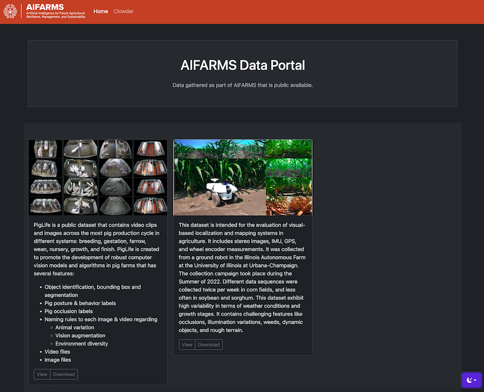

## AIFARMS Data Browser

AIFARMS Data Browser is used to share data collected as part as AIFARMS with others across the world. Using best practices metadata about the data is gathered and recorded in json document as well as representative images of the dataset. Once the data is collected, and the appropriate license is selected the data is zipped and placed in next to datasets.json. At this point it is made available for download.



The view page will show not only the metadata, but also links to download, see the license and a [croissant](https://mlcommons.org/working-groups/data/croissant/) formatted representation of the metadata.

The download page will show the license and a short questionaire. Once this is filled out, a unique link is generated that can be used to download the data.

## Local Development

The repository contains everything needed to run. The data folder has a simmple json document with data, and a single downloadable zip file. To automatically reload the container when changes are made use:
```
docker compose up --build --watch
```

## License

Copyright (c) 2024, University of Illinois

All rights reserved.

Redistribution and use in source and binary forms, with or without modification, are permitted provided that the following conditions are met:

- Redistributions of source code must retain the above copyright notice, this list of conditions and the following disclaimer.
- Redistributions in binary form must reproduce the above copyright notice, this list of conditions and the following disclaimer in the documentation and/or other materials provided with the distribution.
- Neither the name of {{ project }} nor the names of its contributors may be used to endorse or promote products derived from this software without specific prior written permission.

THIS SOFTWARE IS PROVIDED BY THE COPYRIGHT HOLDERS AND CONTRIBUTORS "AS IS" AND ANY EXPRESS OR IMPLIED WARRANTIES, INCLUDING, BUT NOT LIMITED TO, THE IMPLIED WARRANTIES OF MERCHANTABILITY AND FITNESS FOR A PARTICULAR PURPOSE ARE DISCLAIMED. IN NO EVENT SHALL THE COPYRIGHT OWNER OR CONTRIBUTORS BE LIABLE FOR ANY DIRECT, INDIRECT, INCIDENTAL, SPECIAL, EXEMPLARY, OR CONSEQUENTIAL DAMAGES (INCLUDING, BUT NOT LIMITED TO, PROCUREMENT OF SUBSTITUTE GOODS OR SERVICES; LOSS OF USE, DATA, OR PROFITS; OR BUSINESS INTERRUPTION) HOWEVER CAUSED AND ON ANY THEORY OF LIABILITY, WHETHER IN CONTRACT, STRICT LIABILITY, OR TORT (INCLUDING NEGLIGENCE OR OTHERWISE) ARISING IN ANY WAY OUT OF THE USE OF THIS SOFTWARE, EVEN IF ADVISED OF THE POSSIBILITY OF SUCH DAMAGE.

## Activities


