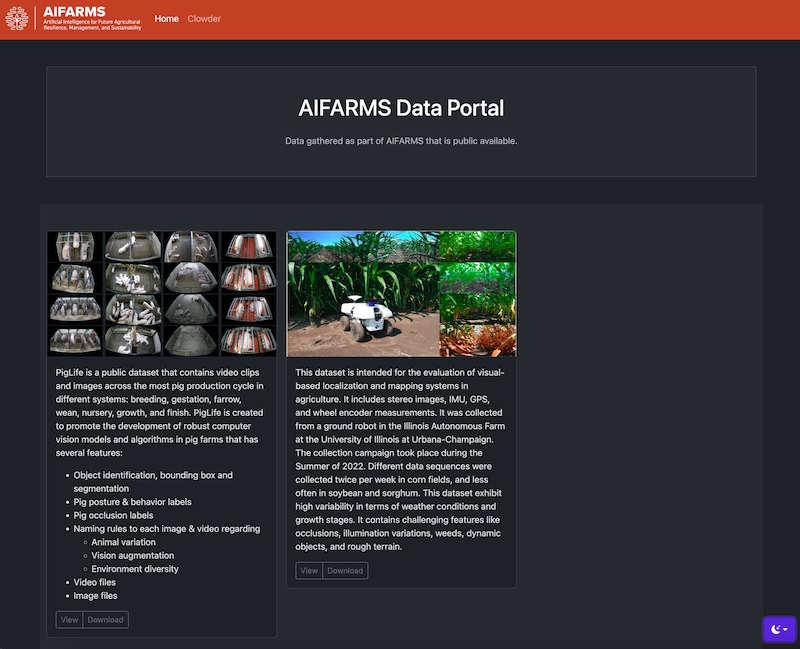

# AIFARMS Data Browser

AIFARMS Data Browser is an open platform for sharing high-quality agricultural datasets with the global research community. It enables dataset creators to publish, document, and license their data using best practices, while making it easy for users to discover, preview, and download datasets for research and development.



## Key Features

- **Rich Metadata**: Each dataset is described with detailed metadata (JSON), including authorship, description, keywords, and licensing information. Representative images and links to related papers or code are provided.
- **Licensing and Compliance**: Datasets are distributed with clear licensing terms. Users must review and accept the license before downloading, ensuring compliance and responsible data use.
- **Download Workflow**: After completing a short questionnaire and accepting the license, users receive a unique, time-limited download link for the dataset (as a ZIP file or external URL).
- **Croissant Metadata**: View datasets in [MLCommons Croissant](https://mlcommons.org/working-groups/data/croissant/) format for interoperability and machine readability.
- **External and Versioned Datasets**: Supports linking to external datasets and tracking dataset versions.
- **Analytics**: Download activity is tracked (future feature), and repository activity is visualized with Repobeats.

## Using the Data Browser

- **Browse**: Explore available datasets, preview metadata, images, and related resources.
- **View**: Inspect detailed metadata, licensing terms, and Croissant-formatted records.
- **Download**: Complete the license agreement and questionnaire to obtain a secure download link.

## Local Development

This repository is self-contained for easy local development and testing.

- Requirements: Python 3.11+, Docker (optional)
- Install dependencies:
  ```
  pip install -r requirements.txt
  ```
- Start with Docker (auto-reloads on changes):
  ```
  docker compose up --build --watch
  ```
- Or run directly:
  ```
  python app.py
  ```
- Access the app at [http://localhost:8080](http://localhost:8080)

## File Structure

- `data/` — Contains datasets.json and all dataset ZIP files
- `templates/` — HTML templates for the web UI
- `static/` — Static assets (CSS, JS, images)
- `app.py` — Main Flask application
- `Dockerfile`, `docker-compose.yaml` — Containerization support
- `requirements.txt` — Python dependencies

## TODO

- [ ] Send email to contact when person accepts license
- [ ] Send email to registeree with link to download
- [ ] Track downloads per dataset
- [X] Add links to other repositories (papers, code)
- [X] Ability to link to external dataset
- [ ] Ability for versions of the dataset
- [ ] Ability to combine multiple datasets

## License

Copyright (c) 2024, University of Illinois

All rights reserved. See [LICENSE](LICENSE) for details.

## Citing Datasets

Each dataset includes citation information (see the dataset metadata or citation file). Please cite appropriately in your work.

## Project Activity


